

  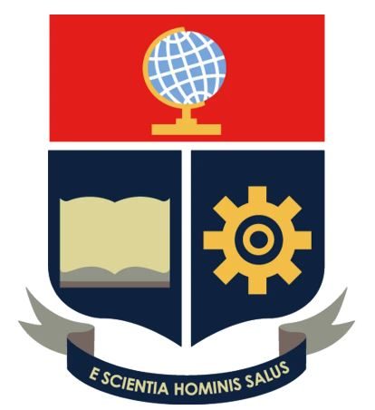

<h1 align="center">2024A_GR2SW_GRx: ProyectoCGrafica2024A</h1>

  Producto como proyecto final de Computación Gráfica de Ingeniería de Software, Escuela Politécnica Nacional.

## Empresa
  - **Nombre:** SAJE inc.
  - **Misión:** Desarrollar herramientas y simulaciones interactivas para el aprendizaje y la educación.
  - **Visión:** Ser líderes en el uso de tecnología gráfica para la educación y el entretenimiento.

  - **Integrantes:** **S**antiago Murillo, **S**aid Luna, **A**lexander Morales, **J**uan Diego Suarez, **E**liath Velasco
  - **Profesor:** Leonardo Valdivieso

## Idea

"Viajando por el espacio"

## Características

- **Simulación del sistema solar**: Incluye modelos de planetas y otros cuerpos celestes.
- **Modelos 3D detallados**: Uso de modelos de alta calidad para representar planetas y la nave.
- **Interactividad**: Controles de usuario para explorar el entorno.

  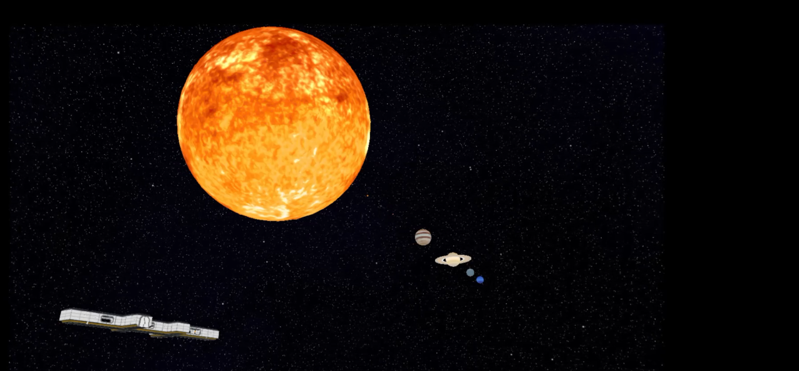

  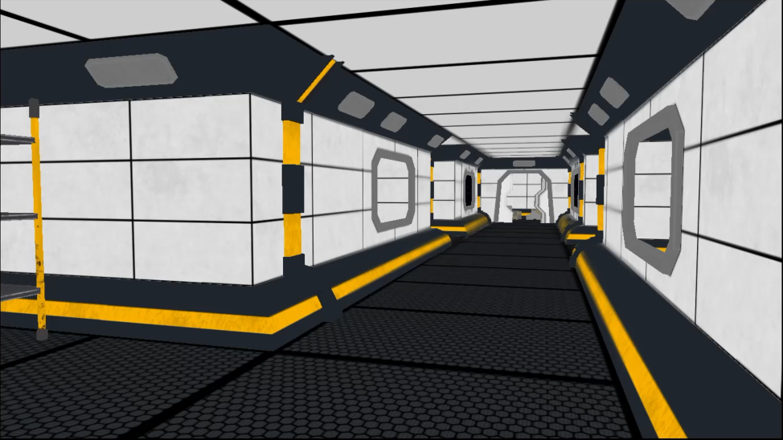

### Lluvia de ideas
- Simulador
- Sistema solar
- Universo
- Nave

### Modelos utilizados en el programa

<h3 align="center">SciFi Hallway</h3>

  

<h3 align="center">Drone</h3>

  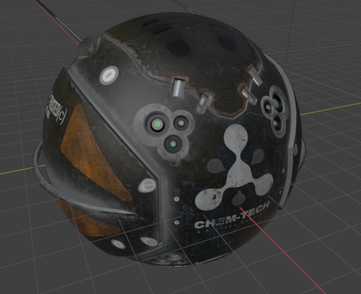

<h3 align="center">Sol</h3>

  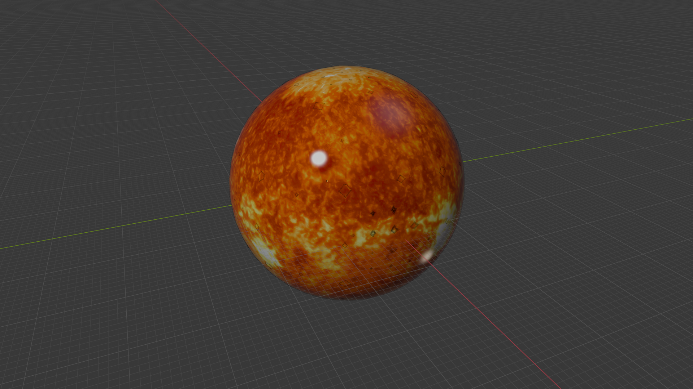

<h3 align="center">Planeta Tierra</h3>

  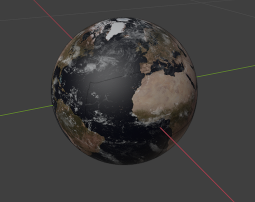

<h3 align="center">Planeta Saturno</h3>

  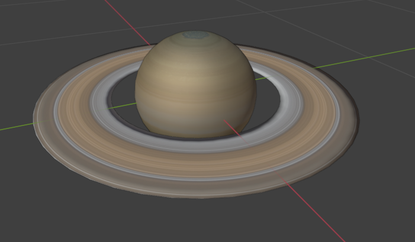

<h3 align="center">Planeta Marte</h3>

  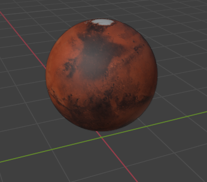

<h3 align="center">Planeta Venus</h3>

  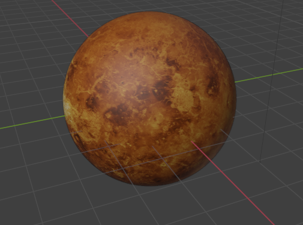

<h3 align="center">Planeta Jupiter</h3>

  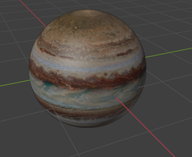

<h3 align="center">Planeta Mercurio</h3>

  

<h3 align="center">Planeta Neptuno</h3>

  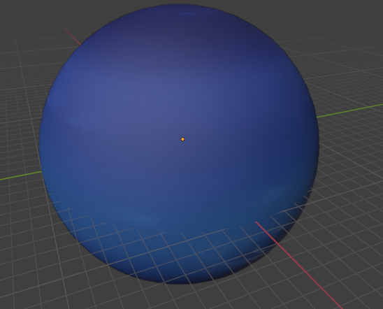

<h3 align="center">Planeta Urano</h3>

  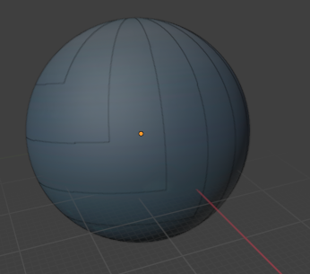

### Posibles modelos a usar:

- [Estrellas](https://sketchfab.com/3d-models/need-some-space-d6521362b37b48e3a82bce4911409303)
- [Planeta Tierra](https://sketchfab.com/3d-models/earth-5ce4b1465c83432d9bb7e3c30232c02b)
- [SciFi Hallway](https://sketchfab.com/3d-models/scifi-hallway-3f57200663904355a21f6ec6cb768594)

### Proyectos similares
- [Sistema Solar](https://youtu.be/fqXXwvij-Tc?si=zgS2olXHU5tc7oDQ)