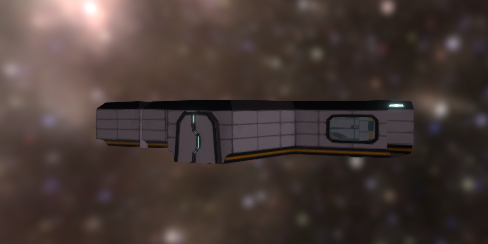

# 2024A_GR2SW_GRx: ProyectoCGrafica2024A
Producto como proyecto fianl de Computacion Grafica de Ingeniería de Software, Escuela Politécnica Nacional.

## Empresa
  - **Nombre:** SAJE inc.
  - **Mision:**
  - **Visión:**

  - **Intergrantes:** **S**antiago Murillo, **S**aid Luna, **A**lexander Morales, **J**uan Diego Suarez, **E**liath Velasco
  - **Profesor:** Leonardo Valdivieso

## Idea

"Viajando por el espacio"

### Lluvia de ideas
Simulador
Sistema solar
Universo
Nave

### Modelos utilizados en el programa

#### SciFi Hallway

### Posibles modelos a usar:

- [Estrellas](https://sketchfab.com/3d-models/need-some-space-d6521362b37b48e3a82bce4911409303)
- [Planeta Tierra](https://sketchfab.com/3d-models/earth-5ce4b1465c83432d9bb7e3c30232c02b)
- [SciFi Hallway](https://sketchfab.com/3d-models/scifi-hallway-3f57200663904355a21f6ec6cb768594)

### Proyectos similares
- [Sistema Solar](https://youtu.be/fqXXwvij-Tc?si=zgS2olXHU5tc7oDQ)

https://jaxry.github.io/panorama-to-cubemap/
